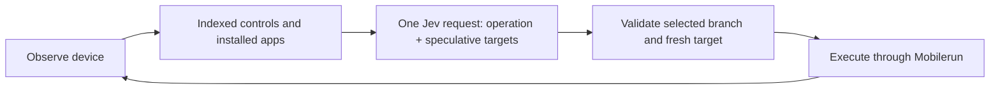

# Mobile Jev

[](https://github.com/droidrun/mobile-jev/blob/main/docs/media/uber-demo.mp4)

**[▶ Watch the demo](https://github.com/droidrun/mobile-jev/blob/main/docs/media/uber-demo.mp4)** — Jev opens Uber, enters a route from San Francisco Airport to the Golden Gate Bridge, and reaches payment selection. The recorded task timer shows about **21 seconds for 9 actions**. A completed booking is not demonstrated.

**One goal. A real Android phone. Jev makes the decisions.**

A standalone mobile agent for [Mobilerun](https://mobilerun.ai), powered by [TypeSafe's Jev](https://docs.typesafe.ai/) and the [Mobilerun API](https://docs.mobilerun.ai/). Includes a live React studio, a CLI, execution traces, and request-level latency measurements. No ADB connection is required.

[Mobilerun](https://mobilerun.ai) · [Mobilerun docs](https://docs.mobilerun.ai) · [TypeSafe](https://typesafe.ai) · [Jev docs](https://docs.typesafe.ai) · [Demo guide](docs/DEMO.md)

## Run it

Requirements: **Node.js 24 recommended** (22.16+ supported), **pnpm 10.30.1**, **curl 7.70+**, a ready Mobilerun Android device, and API keys for Mobilerun and TypeSafe. Tested locally on macOS; CI runs offline tests and the build on Linux.

```sh
git clone https://github.com/droidrun/mobile-jev.git
cd mobile-jev
corepack enable
pnpm install --frozen-lockfile
cp .env.example .env.local
```

Add `MOBILERUN_API_KEY` and `TYPESAFE_API_KEY` to `.env.local`. List your devices, then set `MOBILERUN_DEVICE_ID` to the one you want to control:

```sh
pnpm devices
pnpm doctor
pnpm dev
```

Open **http://127.0.0.1:3040**. Enter a goal and press **Run task**.

- Get a Mobilerun key from [API keys](https://cloud.mobilerun.ai/api-keys).
- Get a TypeSafe key from the [TypeSafe console](https://console.typesafe.ai/).
- Connect or provision your own Android device through Mobilerun. Device/service charges are separate from this project.
- The default API endpoint is production. Set `MOBILERUN_BASE_URL` to your own environment if needed; the code contains no fixed account or device ID.

Already export your variables? That works too. Exported variables take precedence over `.env.local`, which takes precedence over `.env`.

## Included demo: enable dark theme

Ask **“Turn on dark theme in Android Settings.”** Jev discovers Settings from the device's installed apps, opens it through the Mobilerun API, selects the relevant controls, and changes the setting. The demo runner reads the screen again and verifies the actual Dark theme switch is on; it does not accept a model DONE response as proof.

```sh
pnpm demo dark-theme --reset
```

`--reset` first asks Jev to establish and verify an off baseline. Setup, task execution, and verification have separate timings. Every attempt is retained locally, including failures. This is a small reproducible utility demo without accounts, purchases, or travel-app loading. See [what the demo does and its limits](docs/DEMO.md).

## The studio

- A live device stream using the official [`@mobilerun/react`](https://www.npmjs.com/package/@mobilerun/react) component.
- Goal input, executed-action timeline, model latency, and a task clock that stops on completion, failure, or cancellation.
- Stop control, reconnect, fullscreen, and recent runs. Clear removes finished runs and resets the timer. One task owns the configured device at a time.
- The desktop workspace fits in one viewport; activity scrolls inside its panel.

The account API keys stay on the server. The browser receives device-scoped streaming credentials only. The app binds to localhost, validates request origins, and is intended for a single local operator. Public/multi-user hosting requires your own authentication and device authorization. Recent runs are held in memory and cleared on server restart.

## Use the CLI

```sh
# Preview the next decision, without executing it:
pnpm agent run "Turn on dark theme in Android Settings."

# Execute a goal and retain the real model decisions:
pnpm agent run "Turn on dark theme in Android Settings." \
  --execute --steps 20 --trace artifacts/dark-theme.jsonl

# Inspect a phone or measure the API:
pnpm agent observe
pnpm agent screenshot
pnpm agent profile --out artifacts/api-profile.json

# Direct controls for debugging:
pnpm agent tap 300 500
pnpm agent type "San Francisco" --clear
pnpm agent back
```

Use `--device ID` to override the configured device. `pnpm agent --help` lists all options. Traces and screenshots are ignored by git and never overwrite an existing file.

### Local ADB / UiAutomator transport

The CLI can use a local Android device without Mobilerun or cloud device transport. The Jev policy and deterministic freshness, bounds, actionability, and input-verification checks remain unchanged:

```sh
# List trusted local adb devices
pnpm agent --transport uiautomator devices

# Inspect and screenshot a selected device
pnpm agent --transport uiautomator --device SERIAL observe
pnpm agent --transport uiautomator --device SERIAL screenshot --out artifacts/local.png

# Preview or execute a Jev goal locally
pnpm agent --transport uiautomator --device SERIAL run "Find order 42" --text "Order 42" --execute
```

Requirements are Android platform-tools (`adb`) and a USB- or network-trusted device. `ADB_SERIAL` can replace `--device`; `AGENT_TRANSPORT=uiautomator` makes the local transport the default. The local adapter obtains screen size, foreground package, keyboard state, screenshots, and the accessibility tree from `adb`/`uiautomator dump`. App labels are package names because the adapter does not require an on-device instrumentation service. `pnpm doctor uia` checks the local setup.

## How Jev drives it



Jev chooses `OPEN_APP`, `TAP`, `TYPE_TEXT`, scrolling, navigation, `WAIT`, `DONE`, or `BLOCKED`. Operation and compatible-target questions share one request; unused target answers cannot execute. App launch targets come from the installed-app API. When a goal names installed apps explicitly, exact name matching narrows that inventory; otherwise up to 200 apps are offered and the launcher remains available.

The executor resolves coordinates from observed bounds. It validates probability distributions, rejects stale targets, and never retries a device mutation after an uncertain transport failure. It records actions before the next observation, so a failed read cannot erase an executed action.

Text comes from exact spans in the goal. Jev selects a span; code copies it into the field. Supply `--text "exact field value"` to override those candidates. This implementation does not generate arbitrary prose or invent missing personal details. A separate text-generation model is not needed.

Text replacement uses the API's faster `accepted` completion mode when the focused field can be read back. The agent verifies the complete field value in its next observation before asking Jev to continue; an unverified value stops the run without retyping. Appends, password fields, and fields without a readable target retain server-side `committed` completion. Set `MOBILERUN_TEXT_COMPLETION_MODE=committed` (or CLI `--text-completion committed`) to use that mode for every input.

Confidence is visible and an optional `--confidence` cutoff is available. **Jev's DONE response is not independent proof of success.** Check the resulting device state, especially for numeric values, dates, and multi-part goals. The demo runner provides task-specific verification; see [the demo guide](docs/DEMO.md).

## Speed and reproducibility

The model transport reuses its HTTPS connection. Device readiness is cached briefly. The loop observes immediately after actions, with bounded polling for transitions, rather than sleeping after every interaction. Jev still chooses every operation; there are no prepared tap sequences in the policy.

Request timings split DNS, TCP/TLS, response wait, and download from total wall time. Response wait includes network, server, and device work—not just server processing. A 300 ms swipe also includes its requested gesture duration. See [the demo guide](docs/DEMO.md) for measurement boundaries, successes, and failures.

An identical prompt is not guaranteed to produce an identical trace. App version, locale, current screen, account state, network, and model version affect results. `jev-latest` is convenient; set `TYPESAFE_MODEL` to a supported fixed version when comparing runs, and retain the returned model name in the trace.

## Development

```sh
pnpm check       # tests, lint, typecheck, formatting, production build
pnpm build
pnpm start      # production studio on localhost:3040
```

CI requires no API keys and does not control a phone. Live `run --execute` and demo commands make real model/device requests.

| Directory               | Purpose                                                          |
| ----------------------- | ---------------------------------------------------------------- |
| `scripts/mobile-agent/` | Device adapter, Jev policy, executor, transports, CLI and tests  |
| `apps/jev-studio/`      | Next.js studio, device credentials route, SSE and task lifecycle |
| `scripts/doctor.mjs`    | Configuration and device connectivity checks                     |
| `scripts/demo.mjs`      | Repeatable demo and outcome verification                         |
| `artifacts/`            | Local-only traces, screenshots and measurements                  |

MIT licensed; dependencies retain their respective licenses.
